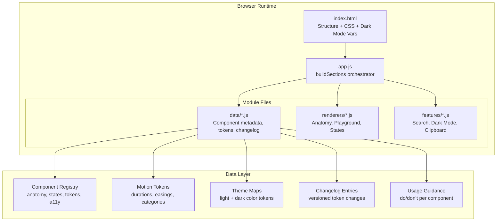

# Design Document: PSP Toolkit Excellence

## Overview

This design document describes the architecture and implementation approach for elevating the PSP Design System toolkit from its current state to a world-class documentation site. The enhancement spans 15 requirements across 5 phases: visual polish (card variants, content density), component documentation depth (anatomy diagrams, states, motion specs), interactive features (playground, search, dark mode), content expansion (usage guidance, breakpoints, edge cases, accessibility, changelog), and developer experience (multi-platform code examples, Figma integration).

### Design Decisions

1. **No build tools** — All features are implemented in vanilla HTML/CSS/JS, maintaining the existing single-page architecture
2. **Modular file organization** — The growing app.js (~1041 lines) will be split into logical module files loaded via `<script>` tags (no ES modules/bundler needed)
3. **Data-driven content** — Component metadata, states, tokens, and guidance are stored as JS data objects, with renderer functions generating HTML
4. **CSS custom properties for theming** — Dark mode uses CSS variable overrides on a `[data-theme="dark"]` attribute on `<html>`
5. **Client-side search** — A lightweight inverted index built at page load from content data objects
6. **Inline SVG for diagrams** — Anatomy diagrams are generated as inline SVG for interactivity (hover, click) without external dependencies

### Constraints

- No external JS frameworks (React, Vue, etc.)
- No build step or bundler
- Must work as a static file served from any HTTP server
- All content generated via the `buildSections()` pattern
- Must maintain backward compatibility with existing navigation and section structure

## Architecture

### High-Level System Diagram



### File Organization

```
project/
├── index.html              (structure, CSS, dark mode variables)
├── app.js                  (buildSections orchestrator, nav setup)
├── data/
│   ├── components.js       (component registry with anatomy, states, a11y)
│   ├── motion-tokens.js    (motion token definitions)
│   ├── themes.js           (light/dark color maps)
│   ├── changelog.js        (token changelog entries)
│   ├── guidance.js         (usage guidance per component)
│   ├── breakpoints.js      (responsive breakpoint specs)
│   └── code-examples.js    (multi-platform code snippets)
├── renderers/
│   ├── anatomy.js          (SVG anatomy diagram generator)
│   ├── playground.js       (interactive component playground)
│   ├── states.js           (state documentation renderer)
│   ├── motion-preview.js   (animated motion token previews)
│   └── changelog.js        (changelog section renderer)
├── features/
│   ├── search.js           (search index + UI)
│   ├── dark-mode.js        (theme toggle + persistence)
│   └── clipboard.js        (copy-to-clipboard utilities)
├── design-tokens.json      (existing token file)
└── PSP Instrument icons/   (existing icon assets)
```

### Loading Strategy

Script files are loaded in dependency order via `<script>` tags at the end of `<body>`, before `app.js`:

```html
<!-- Data layer (no dependencies) -->
<script src="data/components.js"></script>
<script src="data/motion-tokens.js"></script>
<script src="data/themes.js"></script>
<script src="data/changelog.js"></script>
<script src="data/guidance.js"></script>
<script src="data/breakpoints.js"></script>
<script src="data/code-examples.js"></script>

<!-- Features (depend on data) -->
<script src="features/clipboard.js"></script>
<script src="features/dark-mode.js"></script>
<script src="features/search.js"></script>

<!-- Renderers (depend on data + features) -->
<script src="renderers/anatomy.js"></script>
<script src="renderers/playground.js"></script>
<script src="renderers/states.js"></script>
<script src="renderers/motion-preview.js"></script>
<script src="renderers/changelog.js"></script>

<!-- Main orchestrator -->
<script src="app.js"></script>
```

Each file exposes its API on a global namespace object (e.g., `window.PSP.data.components`, `window.PSP.renderers.anatomy`).

## Components and Interfaces

### 1. Component Registry (`data/components.js`)

Central data store for all component metadata. Each component entry contains anatomy parts, interaction states, accessibility info, usage guidance references, and Figma links.

```javascript
window.PSP = window.PSP || {};
window.PSP.data = window.PSP.data || {};

window.PSP.data.components = {
  instrumentTile: {
    name: 'Instrument Tile',
    description: 'Payment method selection tile with radio button',
    figmaNodeId: '9:1857',
    figmaFileKey: 'XoqbHriFr2Efq18TBPG6VQ',
    anatomy: [
      { id: 'radio', label: 'Radio Button', token: '--psp-radio-size: 20px', x: 12, y: 16 },
      { id: 'icon', label: 'Instrument Icon', token: '--psp-icon-size: 54x36px', x: 44, y: 12 },
      { id: 'name', label: 'Instrument Name', token: '--type-body-large', x: 108, y: 14 },
      { id: 'details', label: 'Card Details', token: '--type-body-small', x: 108, y: 34 },
      { id: 'badge', label: 'Offer Badge', token: '--psp-badge-blue', x: 66, y: 0 },
      { id: 'offer', label: 'Offer Text', token: '--color-success', x: 108, y: 52 }
    ],
    states: {
      enabled: { bg: '#FFFFFF', border: '1px solid #D5D9D9', opacity: 1 },
      disabled: { bg: '#FFFFFF', border: '1px solid #D5D9D9', opacity: 0.6, reason: 'Card expired' },
      hovered: { bg: '#F7FAFA', border: '1px solid #D5D9D9', opacity: 1 },
      focused: { bg: '#FFFFFF', border: '2px solid #0972d3', opacity: 1, outline: '2px solid #0972d3' },
      pressed: { bg: '#EDF8FF', border: '2px solid #007185', opacity: 1 },
      dragged: null // Not applicable
    },
    a11y: {
      role: 'radio',
      ariaLabel: '{instrumentName}, {cardDetails}',
      stateAnnouncements: {
        selected: '{instrumentName} selected',
        disabled: '{instrumentName}, not available, {reason}'
      },
      keyboardNav: { select: 'Space/Enter', navigate: 'Arrow Up/Down' },
      minTouchTarget: '44x44px',
      contrastRatio: '4.5:1'
    },
    playground: {
      defaults: { name: 'Amazon Pay ICICI', details: 'VISA ••••0424', badge: 'Best offer', offer: 'Save ₹10', state: 'enabled' },
      controls: ['name', 'details', 'badge', 'offer', 'icon', 'state']
    }
  },
  // ... sectionHeader, badge, ctaBar, savingsBar, bankPill
};
```

### 2. Anatomy Diagram Renderer (`renderers/anatomy.js`)

Generates interactive SVG diagrams with numbered callouts.

```javascript
window.PSP.renderers = window.PSP.renderers || {};

window.PSP.renderers.anatomy = {
  /**
   * Generate an anatomy diagram SVG for a component
   * @param {string} componentId - Key in components registry
   * @returns {string} HTML string containing interactive SVG
   */
  render: function(componentId) { /* ... */ },

  /**
   * Get callout element minimum dimensions
   * @returns {{ width: number, height: number }}
   */
  getMinCalloutSize: function() { return { width: 44, height: 44 }; }
};
```

### 3. Component Playground (`renderers/playground.js`)

Interactive panel with property controls and live preview.

```javascript
window.PSP.renderers.playground = {
  /**
   * Render a playground panel for a component
   * @param {string} componentId
   * @returns {string} HTML string
   */
  render: function(componentId) { /* ... */ },

  /**
   * Generate code snippet for current configuration
   * @param {string} componentId
   * @param {object} config - Current property values
   * @param {string} platform - 'html'|'reactNative'|'android'|'ios'
   * @returns {string} Code snippet
   */
  generateCode: function(componentId, config, platform) { /* ... */ },

  /**
   * Get default configuration for a component
   * @param {string} componentId
   * @returns {object}
   */
  getDefaults: function(componentId) { /* ... */ },

  /**
   * Update live preview (called on property change)
   * @param {string} componentId
   * @param {object} config
   */
  updatePreview: function(componentId, config) { /* ... */ }
};
```

### 4. Search Engine (`features/search.js`)

Client-side inverted index with fuzzy matching.

```javascript
window.PSP.features = window.PSP.features || {};

window.PSP.features.search = {
  /** Build index from all content data */
  buildIndex: function() { /* ... */ },

  /**
   * Search the index
   * @param {string} query
   * @returns {Array<{title: string, section: string, tabIndex: number, snippet: string}>}
   */
  search: function(query) { /* ... */ },

  /** Initialize keyboard shortcut and UI */
  init: function() { /* ... */ }
};
```

### 5. Dark Mode (`features/dark-mode.js`)

Theme switching via CSS custom property overrides.

```javascript
window.PSP.features.darkMode = {
  /** Toggle dark mode on/off */
  toggle: function() { /* ... */ },

  /** Get current theme ('light' | 'dark') */
  getTheme: function() { /* ... */ },

  /** Persist preference to localStorage */
  save: function(theme) { /* ... */ },

  /** Load persisted preference */
  load: function() { /* ... */ },

  /** Initialize (read localStorage, apply theme, render toggle) */
  init: function() { /* ... */ }
};
```

### 6. Card Variant System

Three card styles implemented as CSS utility classes:

```css
/* Elevated - shadow-based depth */
.card--elevated {
  background: var(--color-surface);
  border: none;
  border-radius: var(--radius-md);
  box-shadow: var(--elevation-2);
}

/* Filled - solid background, no border */
.card--filled {
  background: var(--color-surface-variant);
  border: none;
  border-radius: var(--radius-md);
  box-shadow: none;
}

/* Outlined - border-based, no shadow */
.card--outlined {
  background: var(--color-surface);
  border: 1px solid var(--color-outline-variant);
  border-radius: var(--radius-md);
  box-shadow: none;
}
```

### 7. Motion Token System (`data/motion-tokens.js`)

```javascript
window.PSP.data.motionTokens = {
  selection: {
    name: 'Selection Transition',
    duration: 200,
    easing: 'cubic-bezier(0.2, 0, 0, 1)',
    properties: ['background-color', 'border-color', 'box-shadow'],
    category: 'standard' // auto-derived from duration
  },
  expansion: {
    name: 'Expansion Animation',
    duration: 300,
    easing: 'cubic-bezier(0.05, 0.7, 0.1, 1)',
    properties: ['height', 'opacity', 'padding'],
    category: 'standard'
  },
  // ...
};
```

### 8. Syntax Highlighter (`features/clipboard.js` extended)

Lightweight regex-based syntax highlighting for 4 languages:

```javascript
window.PSP.features.highlight = {
  /**
   * Apply syntax highlighting to code string
   * @param {string} code
   * @param {string} language - 'html'|'jsx'|'xml'|'swift'
   * @returns {string} HTML with <span> color classes
   */
  highlight: function(code, language) { /* ... */ }
};
```

## Data Models

### Component Entry Schema

```typescript
interface ComponentEntry {
  name: string;
  description: string;
  figmaNodeId: string;
  figmaFileKey: string;
  anatomy: AnatomyPart[];
  states: Record<StateName, StateSpec | null>;
  a11y: AccessibilitySpec;
  playground: PlaygroundConfig;
}

interface AnatomyPart {
  id: string;
  label: string;
  token: string;       // CSS token reference
  x: number;           // Position in diagram (percentage or px)
  y: number;
}

type StateName = 'enabled' | 'disabled' | 'hovered' | 'focused' | 'pressed' | 'dragged';

interface StateSpec {
  bg: string;
  border: string;
  opacity: number;
  outline?: string;
  reason?: string;     // For disabled state explanation
}

interface AccessibilitySpec {
  role: string;
  ariaLabel: string;   // Template with {placeholders}
  stateAnnouncements: Record<string, string>;
  keyboardNav: Record<string, string>;
  minTouchTarget: string;
  contrastRatio: string;
}

interface PlaygroundConfig {
  defaults: Record<string, string>;
  controls: string[];  // Property names that can be modified
}
```

### Motion Token Schema

```typescript
interface MotionToken {
  name: string;
  duration: number;           // milliseconds
  easing: string;             // cubic-bezier value
  properties: string[];       // CSS properties animated
  category: 'micro' | 'standard' | 'complex';  // derived from duration
}
```

### Theme Color Map Schema

```typescript
interface ThemeColorMap {
  light: Record<string, string>;  // CSS variable name -> hex value
  dark: Record<string, string>;   // CSS variable name -> hex value
}
```

### Changelog Entry Schema

```typescript
interface ChangelogEntry {
  version: string;        // e.g., "2.1.0"
  date: string;           // ISO date string
  type: 'addition' | 'modification' | 'deprecation';
  tokenName: string;
  previousValue?: string; // For modifications
  newValue: string;
  description?: string;
}
```

### Search Index Schema

```typescript
interface SearchIndex {
  // Inverted index: keyword -> array of results
  index: Record<string, SearchResult[]>;
}

interface SearchResult {
  title: string;
  section: string;       // Section identifier
  tabIndex: number;      // Navigation tab index
  snippet: string;       // Context snippet for display
  type: 'section' | 'component' | 'token' | 'content';
}
```

### Usage Guidance Schema

```typescript
interface UsageGuidance {
  componentId: string;
  whenToUse: UsageScenario[];    // minimum 3
  whenNotToUse: AntiPattern[];   // minimum 2
}

interface UsageScenario {
  scenario: string;
  explanation: string;
}

interface AntiPattern {
  scenario: string;
  explanation: string;
  alternative: string;  // Recommended alternative
}
```

### Breakpoint Schema

```typescript
interface BreakpointSpec {
  name: string;           // 'mobile' | 'tablet' | 'desktop' | 'largeDesktop'
  range: string;          // e.g., '< 600px'
  columns: number;
  spacing: string;        // Spacing token used
  componentSizes: Record<string, string>;  // Component -> size adjustment
}
```

### Error Recovery Flow Schema

```typescript
interface ErrorRecoveryFlow {
  componentId: string;
  errorType: string;
  errorMessage: string;
  availableActions: string[];
  resultingState: string;
  diagram: FlowStep[];
}

interface FlowStep {
  id: string;
  label: string;
  type: 'error' | 'action' | 'resolution';
  next?: string;  // ID of next step
}
```

## Correctness Properties

*A property is a characteristic or behavior that should hold true across all valid executions of a system — essentially, a formal statement about what the system should do. Properties serve as the bridge between human-readable specifications and machine-verifiable correctness guarantees.*

### Property 1: Card variant style mapping produces correct CSS

*For any* card variant name in the set {elevated, filled, outlined}, the card variant style function SHALL return a CSS object where: elevated has a non-none box-shadow and no border, filled has a non-surface background and no border/shadow, and outlined has a border and no shadow.

**Validates: Requirements 1.1**

### Property 2: Anatomy diagram generation produces valid SVG with sequential callouts

*For any* component in the documented component registry, the anatomy diagram renderer SHALL produce an SVG string containing numbered callout elements (1 through N where N equals the component's anatomy parts count), each with pointer/line elements connecting to the component visualization.

**Validates: Requirements 2.1, 2.2**

### Property 3: Anatomy diagram interactive elements meet minimum touch target size

*For any* generated anatomy diagram, all interactive callout elements SHALL have rendered dimensions of at least 44x44 CSS pixels.

**Validates: Requirements 2.4**

### Property 4: State documentation completeness and CSS diff

*For any* component in the registry and any non-Enabled state that is applicable (not null), the state documentation SHALL include at least one CSS property change relative to the Enabled state. For states marked as null (not applicable), the output SHALL contain a "Not applicable" indicator with explanation text.

**Validates: Requirements 3.1, 3.3, 3.5**

### Property 5: Motion token structure and categorization

*For any* motion token in the system, it SHALL contain a duration (positive number), an easing (valid cubic-bezier string), and a properties array (non-empty). Furthermore, tokens with duration < 200ms SHALL be categorized as "micro", 200-500ms as "standard", and > 500ms as "complex".

**Validates: Requirements 4.2, 4.5**

### Property 6: Dark mode color completeness

*For any* color role defined in the light theme map, a corresponding entry SHALL exist in the dark theme map, and the dark value SHALL differ from the light value.

**Validates: Requirements 5.2, 5.3**

### Property 7: Dark mode preference persistence round-trip

*For any* theme preference value ('light' or 'dark'), saving it via the dark mode persistence function and then loading it SHALL return the same value.

**Validates: Requirements 5.5**

### Property 8: Component playground provides all state toggles and generates valid code

*For any* component in the registry, the playground renderer SHALL produce controls for all 6 interaction states. Additionally, for any valid component configuration and any platform format, the code generator SHALL produce a non-empty string containing the configured property values.

**Validates: Requirements 6.1, 6.3, 6.5**

### Property 9: Playground reset restores default configuration

*For any* component, after applying arbitrary valid property modifications and then invoking reset, the resulting configuration SHALL equal the component's default configuration from the registry.

**Validates: Requirements 6.6**

### Property 10: Search index coverage and retrieval

*For any* item that exists in the content (section title, component name, or design token name), searching for that exact term SHALL return at least one result containing that item. Conversely, for any random string not present in any indexed content, the search SHALL return zero results.

**Validates: Requirements 7.2, 7.3, 7.5**

### Property 11: Usage guidance completeness

*For any* component in the registry, the usage guidance data SHALL contain at least 3 "when to use" scenarios and at least 2 "when not to use" anti-patterns, where each anti-pattern includes a non-empty recommended alternative.

**Validates: Requirements 8.1, 8.2, 8.3**

### Property 12: Breakpoint specification completeness

*For any* breakpoint in the documented set {mobile, tablet, desktop, largeDesktop}, the specification SHALL include column count (positive integer), spacing adjustment (valid token reference), and at least one component size modification.

**Validates: Requirements 9.2**

### Property 13: Card content density constraints

*For any* card rendered by the toolkit, the content area SHALL have padding >= 24px and max-width <= 720px.

**Validates: Requirements 10.1, 10.4**

### Property 14: Multi-platform code example coverage

*For any* component in the registry, code examples SHALL exist for all 4 platform formats (HTML/CSS, React Native, Android XML, iOS SwiftUI), and each example SHALL reference all design tokens used by that component.

**Validates: Requirements 11.1, 11.3**

### Property 15: Syntax highlighting produces language-appropriate output

*For any* code string and supported language identifier, the syntax highlighter SHALL produce output containing at least one colored span element with a language-appropriate CSS class.

**Validates: Requirements 11.5**

### Property 16: Changelog entry structure and ordering

*For any* changelog entry, it SHALL contain version (non-empty string), date (valid ISO date), tokenName (non-empty), and newValue (non-empty). For entries of type 'modification', previousValue SHALL also be non-empty. For any list of changelog entries rendered together, they SHALL appear in reverse chronological order (newest date first).

**Validates: Requirements 12.2, 12.3, 12.4**

### Property 17: Edge case documentation coverage

*For any* component in the registry, edge case documentation SHALL contain entries covering empty states, overflow text, and loading states. Each error recovery flow SHALL specify errorMessage (non-empty), availableActions (non-empty array), and resultingState (non-empty).

**Validates: Requirements 13.1, 13.3**

### Property 18: Accessibility documentation completeness

*For any* component in the registry, the accessibility documentation SHALL include ARIA role, at least one state announcement, keyboard navigation patterns, and a compliance checklist with at least one item.

**Validates: Requirements 14.1, 14.2, 14.3, 14.5**

## Error Handling

### Figma Embed Failures (Requirement 15)

When a Figma embed iframe fails to load (network error, auth issue, or timeout after 10 seconds):
1. Hide the iframe
2. Display a fallback static image (pre-captured PNG of the component)
3. Show error message: "Figma preview unavailable"
4. Provide a "Retry" button that reloads the iframe src
5. Always show "Open in Figma" link as fallback navigation

```javascript
function handleFigmaError(embedEl, componentId) {
  var fallback = document.createElement('div');
  fallback.className = 'figma-fallback';
  fallback.innerHTML = ''
    + '<p class="figma-error">Figma preview unavailable</p>'
    + '<button onclick="retryFigmaEmbed(\'' + componentId + '\')">Retry</button>';
  embedEl.parentNode.replaceChild(fallback, embedEl);
}
```

### Search Edge Cases

- **Empty query**: Return empty results, don't show "no results" message
- **Very short query (< 2 chars)**: Return empty results to avoid noise
- **Special characters**: Strip regex-unsafe characters before matching
- **Very long query**: Truncate to first 100 characters

### Clipboard API Fallback

If `navigator.clipboard.writeText` is unavailable (older browsers, non-HTTPS):
1. Fall back to `document.execCommand('copy')` with a temporary textarea
2. Show toast notification regardless of method used
3. If both fail, show "Copy failed — please copy manually" toast

### Dark Mode Transition

- Apply `transition: background-color 0.3s, color 0.3s, border-color 0.3s` to all themed elements
- Use `prefers-reduced-motion` media query to disable transitions for users who prefer reduced motion
- If localStorage is unavailable (private browsing), default to light mode without persistence

### Component Playground Validation

- Clamp text inputs to character limits defined in `charLimits`
- If a user enters text exceeding the limit, truncate with ellipsis and show a warning
- Invalid state combinations (e.g., dragged state for non-draggable components) show "Not applicable" instead of broken preview

## Testing Strategy

### Unit Tests (Example-Based)

Use a lightweight test runner (e.g., inline test harness or simple assertion functions) since there's no build tool:

- **Card variant rendering**: Verify each variant produces correct CSS classes
- **Dark mode toggle**: Verify theme attribute switches and localStorage is written
- **Search UI**: Verify Cmd+K opens search, result selection navigates correctly
- **Figma embed fallback**: Verify error handler shows fallback image and retry button
- **Breakpoint preview**: Verify resizable frame responds to drag

### Property-Based Tests

Use **fast-check** (loaded via CDN `<script>` tag) for property-based testing. Minimum 100 iterations per property.

**Configuration:**
```html
<script src="https://cdn.jsdelivr.net/npm/fast-check/lib/bundle.js"></script>
```

**Test structure:**
```javascript
// Feature: psp-toolkit-excellence, Property 5: Motion token structure and categorization
fc.assert(fc.property(
  fc.constantFrom(...Object.keys(window.PSP.data.motionTokens)),
  function(tokenKey) {
    var token = window.PSP.data.motionTokens[tokenKey];
    // duration is positive number
    assert(typeof token.duration === 'number' && token.duration > 0);
    // easing is cubic-bezier
    assert(/^cubic-bezier\(.+\)$/.test(token.easing));
    // properties is non-empty array
    assert(Array.isArray(token.properties) && token.properties.length > 0);
    // categorization is correct
    if (token.duration < 200) assert(token.category === 'micro');
    else if (token.duration <= 500) assert(token.category === 'standard');
    else assert(token.category === 'complex');
    return true;
  }
), { numRuns: 100 });
```

**Properties to implement as PBT:**
1. Card variant style mapping (Property 1)
2. Anatomy diagram SVG generation (Property 2)
3. Touch target minimum size (Property 3)
4. State documentation completeness (Property 4)
5. Motion token structure (Property 5)
6. Dark mode color completeness (Property 6)
7. Dark mode persistence round-trip (Property 7)
8. Playground state toggles and code generation (Property 8)
9. Playground reset idempotence (Property 9)
10. Search index coverage (Property 10)
11. Usage guidance completeness (Property 11)
12. Breakpoint spec completeness (Property 12)
13. Card density constraints (Property 13)
14. Multi-platform code coverage (Property 14)
15. Syntax highlighting output (Property 15)
16. Changelog structure and ordering (Property 16)
17. Edge case documentation coverage (Property 17)
18. Accessibility documentation completeness (Property 18)

### Integration Tests

- Full page load: Verify all sections render without JS errors
- Navigation: Verify all sidebar items switch tabs correctly
- Dark mode end-to-end: Toggle, verify visual change, reload, verify persistence
- Search end-to-end: Type query, verify results, click result, verify navigation
- Playground end-to-end: Modify properties, verify preview updates, copy code, verify clipboard

### Accessibility Testing

- Automated: Run axe-core on each section to verify WCAG 2.1 AA compliance
- Manual: Keyboard navigation through all interactive elements
- Screen reader: Verify announcements for state changes in playground
